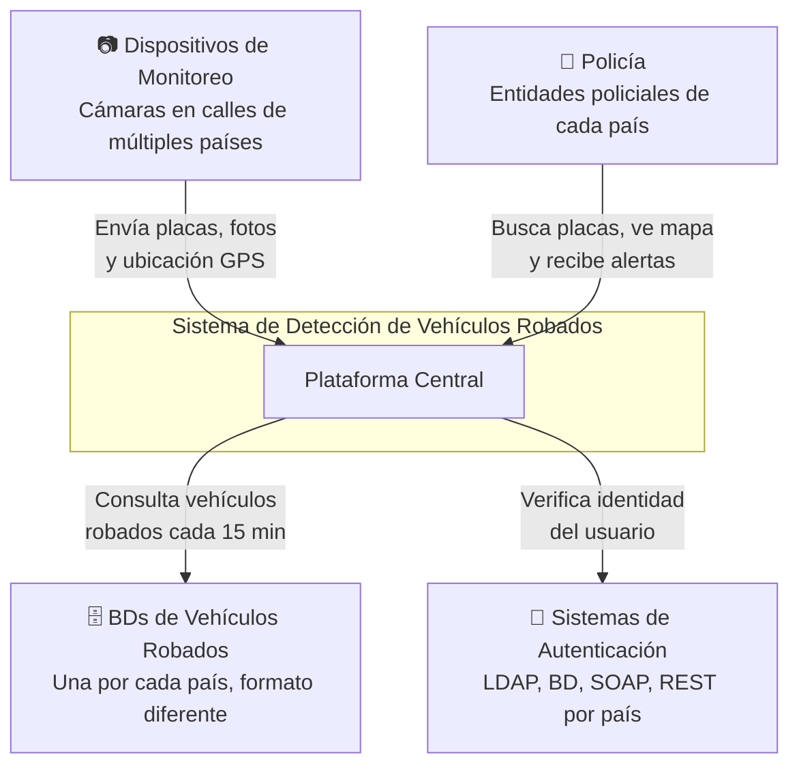
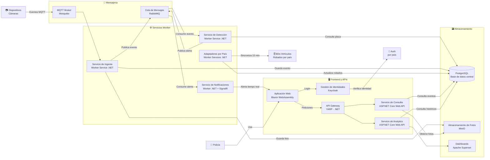
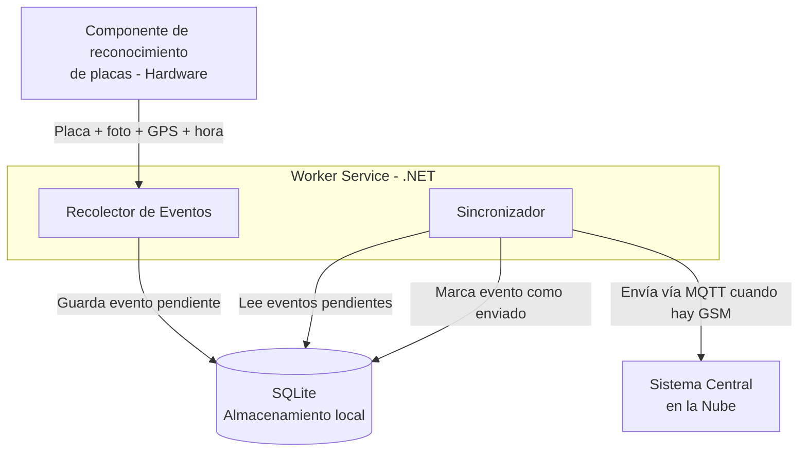
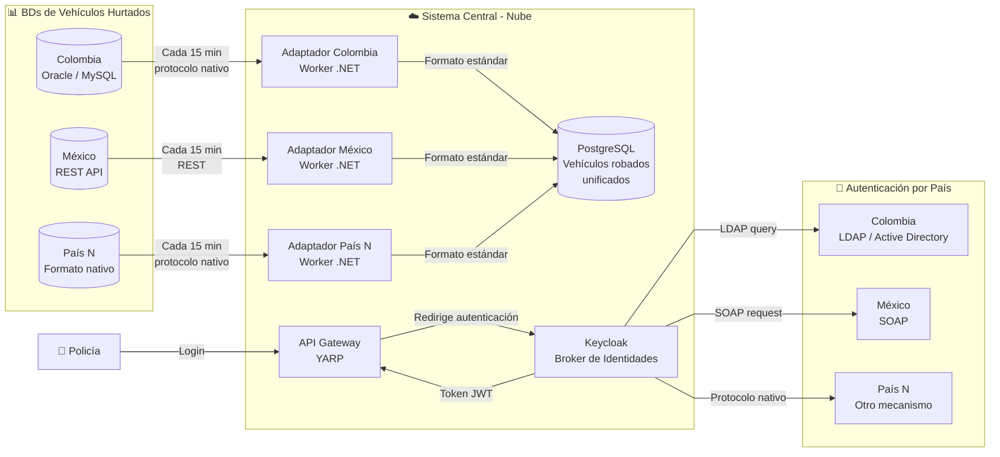
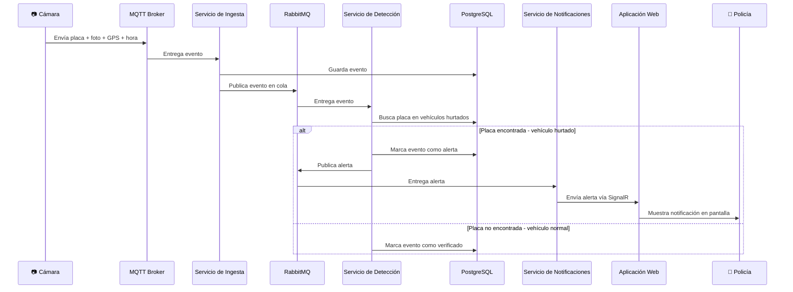
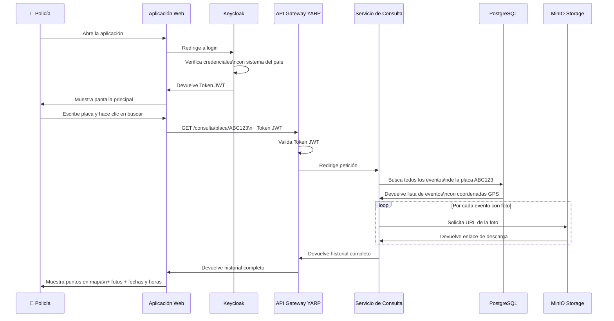
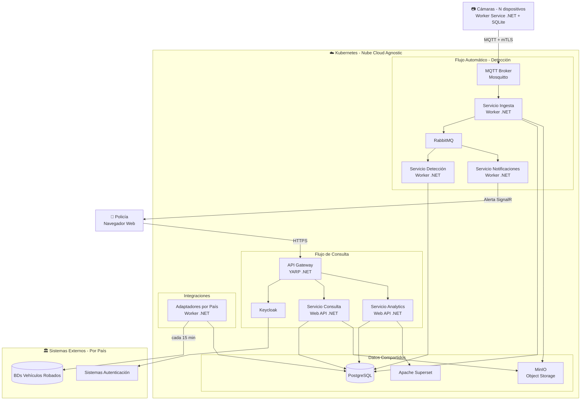
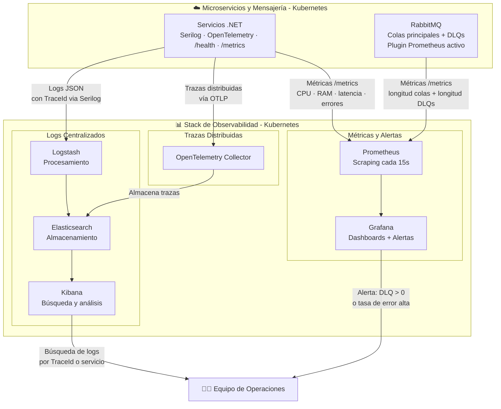

# Propuesta de Arquitectura de Solución
## Sistema para Combatir el Hurto de Vehículos — Ceiba

---

## 1. Resumen de la Propuesta

El sistema propuesto es una plataforma distribuida, cloud-agnostic y de alta disponibilidad que conecta los dispositivos de monitoreo de tráfico instalados en las calles de múltiples países con las bases de datos de vehículos hurtados de cada entidad policial, con el objetivo de detectar en tiempo real vehículos robados, alertar a las autoridades y facilitar la investigación y el análisis de tendencias de hurto.

La arquitectura se sustenta en tres pilares:

1. **Capa edge:** un agente de software desarrollado en .NET que corre dentro de cada dispositivo, garantizando la recolección y sincronización de datos incluso ante fallas de energía o conectividad.
2. **Capa cloud:** un conjunto de microservicios independientes en ASP.NET Core / C#, orquestados en Kubernetes, que cubren la ingesta de eventos, la detección de vehículos hurtados, la consulta por parte de la policía, las notificaciones en tiempo real y el análisis de tendencias.
3. **Capa de integración:** adaptadores por país para homologar las bases de datos heterogéneas de vehículos hurtados, y un broker de identidades (Keycloak) para federar los sistemas de autenticación de cada entidad policial.

El diseño evita el acoplamiento con cualquier proveedor de nube mediante el uso exclusivo de tecnologías open source y estándares abiertos, permitiendo migrar entre proveedores o desplegar en una nube privada sin modificar el código de los servicios.

---

## 2. Arquitectura de la Solución

### 2.1 Diagrama de Contexto (C4 Nivel 1)

Vista de alto nivel del sistema y sus interacciones con actores y sistemas externos.

**Descripción:** El sistema recibe eventos de los dispositivos de monitoreo desplegados en múltiples países, se integra con las bases de datos de vehículos hurtados de cada entidad policial y con sus sistemas de autenticación, y provee a los usuarios policiales las funcionalidades de consulta, alerta y análisis.

---

### 2.2 Diagrama de Contenedores (C4 Nivel 2)

Vista interna del sistema mostrando todos los bloques tecnológicos y sus relaciones.

**Descripción:** El diagrama muestra dos flujos principales. El flujo automático (izquierda): los dispositivos envían eventos via MQTT, el Servicio de Ingesta los persiste y los publica en RabbitMQ, el Servicio de Detección los compara contra la base de datos unificada de vehículos hurtados y, si hay coincidencia, publica una alerta que el Servicio de Notificaciones entrega en tiempo real al policía. El flujo de consulta (derecha): el policía se autentica via Keycloak, accede al API Gateway y consulta el historial de una placa o los dashboards de analytics.

---

### 2.3 Diagrama del Componente del Dispositivo (Cámara)

Vista interna del software que corre dentro de cada dispositivo de monitoreo.

**Descripción:** El Worker Service en .NET es el único software que se instala en cada dispositivo. Internamente tiene dos responsabilidades: el Recolector de Eventos consulta periódicamente el componente de hardware que ya reconoce las matrículas y persiste cada evento en SQLite (base de datos local en disco). El Sincronizador verifica constantemente la disponibilidad de la conexión GSM y, cuando la hay, envía los eventos pendientes al sistema central via MQTT, marcándolos como enviados en SQLite. Este patrón garantiza que ningún evento capturado mientras el dispositivo esté encendido se pierda ante fallas de conectividad. Ante fallas de energía, se preservan todos los eventos registrados hasta el momento del apagado — la batería de respaldo de 1 hora maximiza la ventana de captura antes del apagado.

---

### 2.4 Diagrama de Integración

Vista detallada de cómo el sistema se integra con los sistemas externos de cada país.

**Descripción:** La integración tiene dos dimensiones. Para los datos de vehículos hurtados, se implementa el patrón Adapter — un Worker Service en .NET por cada país que conoce el protocolo y formato de la fuente de datos de ese país, extrae la información y la normaliza al esquema estándar del sistema. Para la autenticación, Keycloak actúa como broker de identidades: el sistema solo habla con Keycloak, y Keycloak se encarga de hablar con el sistema de autenticación de cada país sin importar el protocolo que use.

---

### 2.5 Diagrama de Flujo — Vehículo Hurtado Avistado

Secuencia del proceso automático de detección y alerta.

**Descripción:** El flujo es completamente automático desde que la cámara detecta una placa hasta que la alerta llega al policía. El uso de RabbitMQ como intermediario entre los servicios garantiza que ningún evento se pierda ante fallas parciales del sistema y desacopla la velocidad de producción de la velocidad de procesamiento.

---

### 2.6 Diagrama de Flujo — Policía Busca una Matrícula

Secuencia del proceso de consulta manual de historial de un vehículo.

**Descripción:** El policía interactúa únicamente con la aplicación web. Keycloak maneja la autenticación federada con el sistema del país del usuario y emite un Token JWT que el API Gateway valida en cada petición. El Servicio de Consulta recupera el historial de la placa desde PostgreSQL y las URLs de las fotos desde MinIO, y los devuelve al frontend para su visualización en el mapa con Leaflet.js.

---

### 2.7 Diagrama de Despliegue

Vista de la infraestructura y cómo viven los componentes en la nube.

**Descripción:** Todos los servicios corren como contenedores Docker dentro de un cluster Kubernetes, lo que garantiza portabilidad entre proveedores de nube. La capa de datos (PostgreSQL, RabbitMQ, MinIO) puede correr dentro del mismo cluster o como servicios administrados del proveedor cloud, en ambos casos usando tecnologías open source sin lock-in. La infraestructura se aprovisiona mediante **Terraform**, permitiendo reproducir el entorno en cualquier nube con un solo comando.

---

### 2.8 Diagrama de Observabilidad

Vista de cómo se recolectan logs, métricas y trazas de todos los componentes del sistema, incluyendo el monitoreo de las Dead Letter Queues.

**Descripción:** Cada microservicio .NET expone dos canales de observabilidad: logs estructurados en JSON via Serilog (que incluyen el `TraceId` del evento para correlacionar entre servicios) y métricas via un endpoint `/metrics` estándar de Prometheus. RabbitMQ expone sus propias métricas via el plugin oficial de Prometheus, incluyendo la longitud de cada cola — las DLQs incluidas. Grafana consume esas métricas y tiene configurada una alerta que se dispara cuando cualquier DLQ acumula mensajes, notificando al equipo de operaciones para inspección y reinyección. OpenTelemetry recolecta las trazas distribuidas y las almacena en Elasticsearch, donde Kibana permite seguir el recorrido completo de cualquier evento usando su `TraceId`.

---

## 3. Componentes Principales

### 3.1 Worker Service del Dispositivo (.NET)

Programa instalado en cada cámara. Contiene dos responsabilidades internas:
- **Recolector de Eventos:** consulta el componente de hardware que reconoce matrículas y persiste cada evento (placa, foto, GPS, hora) en SQLite.
- **Sincronizador:** monitorea la conexión GSM y, cuando está disponible, envía los eventos pendientes al sistema central via MQTT usando la librería **MQTTnet**, marcando cada evento como enviado tras confirmación. Implementa resiliencia con **Polly** (retry con backoff exponencial).

### 3.2 MQTT Broker — Mosquitto

Servidor de mensajería ligero que recibe las conexiones de los dispositivos. Configurado con autenticación mTLS para garantizar que solo dispositivos con certificado válido puedan conectarse. Para escenarios de alta escala (>10.000 dispositivos) se reemplaza por **EMQX** sin cambios en los dispositivos ni en los microservicios.

### 3.3 Servicio de Ingesta (Worker Service .NET)

Recibe eventos del MQTT Broker mediante **MQTTnet** (suscripción directa al topic del broker). Por cada evento recibido: persiste el evento en PostgreSQL, almacena la foto en MinIO y publica el evento en RabbitMQ usando **MassTransit** para procesamiento asíncrono. El canal MQTT (dispositivo → broker) y el canal de mensajería interna (broker → microservicios) son deliberadamente independientes: MQTTnet maneja la capa IoT y MassTransit maneja la capa de microservicios.

**Idempotencia:** el patrón store-and-forward del dispositivo puede generar duplicados ante reconexiones GSM (el dispositivo reenvía eventos no confirmados). Para prevenirlos, cada evento incluye un `event_id` único (UUID generado en el dispositivo en el momento del registro). El Servicio de Ingesta realiza un `INSERT ... ON CONFLICT DO NOTHING` sobre ese campo en PostgreSQL — si el evento ya existe, la operación no hace nada y el servicio lo descarta silenciosamente sin propagar el duplicado a RabbitMQ.

### 3.4 Servicio de Detección (Worker Service .NET)

Consume eventos de RabbitMQ via MassTransit. Busca la placa en la tabla unificada de vehículos hurtados en PostgreSQL. Si hay coincidencia, publica una alerta en RabbitMQ y actualiza el estado del evento. Implementa Circuit Breaker con **Polly** para protegerse ante fallas de PostgreSQL.

### 3.5 Servicio de Consulta (ASP.NET Core Web API)

Expone endpoints REST consumidos por el frontend via API Gateway. Permite buscar el historial de avistamientos de una placa con coordenadas GPS y URLs de fotos. Usa índices en PostgreSQL sobre el campo de matrícula para garantizar tiempos de respuesta óptimos a escala.

### 3.6 Servicio de Notificaciones (Worker Service .NET + SignalR)

Consume alertas de RabbitMQ y las entrega en tiempo real al frontend usando **SignalR**. Los usuarios policiales están agrupados por país, garantizando que las alertas lleguen solo a las autoridades del país correspondiente al vehículo hurtado. Como canal de respaldo envía notificación por correo electrónico.

### 3.7 Servicio de Analytics (ASP.NET Core Web API)

Expone endpoints de estadísticas y se integra con Apache Superset para dashboards avanzados. Los análisis más útiles para operaciones de seguridad: zonas de mayor concentración de hurtos, rutas de escape frecuentes, distribución horaria y comparativas entre ciudades y países.

### 3.8 Adaptadores por País (Worker Services .NET)

Un Worker Service por cada país integrado. Cada adaptador conoce el protocolo y formato de la fuente de datos de su país (Oracle, MySQL, REST, archivos, etc.), extrae los vehículos hurtados y los normaliza al esquema estándar del sistema en PostgreSQL. Se sincronizan cada 15 minutos. Nuevos países se incorporan desarrollando un nuevo adaptador sin modificar el sistema central.

### 3.9 API Gateway — YARP (.NET)

Punto de entrada único para el frontend. Valida el Token JWT en cada petición y enruta al microservicio correspondiente. Implementa rate limiting para proteger los servicios de abusos.

### 3.10 Keycloak

Broker de identidades que federa los sistemas de autenticación de cada entidad policial (LDAP, Active Directory, SOAP, REST). El sistema solo habla con Keycloak; Keycloak se encarga de la comunicación con cada sistema externo. Emite tokens JWT estándar usados por el API Gateway.

### 3.11 Aplicación Web — Blazor WebAssembly

Frontend desarrollado en C# con Blazor WebAssembly, manteniendo el stack 100% .NET. Integra **BlazorLeaflet** (wrapper de Leaflet.js) para la visualización de eventos en mapa. Recibe alertas en tiempo real via SignalR sin necesidad de recargar la página.

### 3.12 PostgreSQL

Base de datos relacional central. Almacena eventos de avistamiento, vehículos hurtados unificados y alertas generadas. Índices optimizados sobre matrícula y fecha para consultas eficientes a gran escala.

### 3.13 MinIO

Almacenamiento de objetos compatible con S3. Almacena las fotos de los vehículos avistados. La compatibilidad con S3 es deliberada: si en algún momento se migra a AWS S3 o Azure Blob Storage, el código de los servicios no cambia.

### 3.14 RabbitMQ

Cola de mensajes que desacopla los microservicios y actúa como buffer de resiliencia. Garantiza que los eventos no se pierdan ante fallas parciales del sistema. Integrado en .NET via **MassTransit**.

### 3.15 Apache Superset

Herramienta de visualización de datos open source conectada a PostgreSQL. Provee dashboards interactivos con mapas de calor geoespaciales, gráficas de tendencias y análisis histórico sin costo de licencia.

---

## 4. Decisiones de Diseño

### 4.1 Patrón Store-and-Forward en los dispositivos

**Decisión:** siempre persistir primero en SQLite y sincronizar después, nunca enviar directo al sistema central.

**Justificación:** la conexión GSM puede interrumpirse en cualquier momento y la batería de respaldo dura 1 hora ante fallas de energía. Sin persistencia local, todos los eventos capturados durante esa hora antes del apagado se perderían permanentemente. El patrón store-and-forward garantiza que los eventos registrados mientras el dispositivo esté operativo no se pierdan — independientemente de cuándo vuelva la conectividad. Los eventos no capturables durante un apagado prolongado son una limitación de hardware conocida y asumida. SQLite no requiere instalación adicional, se embebe en el ejecutable .NET y crea su archivo de datos automáticamente al primer arranque.

**Alternativa considerada:** enviar directo cuando hay conexión y descartar cuando no. Descartada porque compromete la integridad del dato, que es crítica en un sistema de seguridad pública.

### 4.2 MQTT sobre HTTP para la comunicación de dispositivos

**Decisión:** usar MQTT (via MQTTnet en .NET) en lugar de HTTP para la comunicación entre dispositivos y sistema central, incluyendo el envío de la foto embebida en el payload del evento.

**Justificación:** MQTT está diseñado específicamente para dispositivos IoT con recursos limitados e internet inestable. Mantiene una conexión persistente, consume menos ancho de banda y tiene niveles de garantía de entrega integrados (QoS). HTTP abriría y cerraría una conexión por cada evento, siendo más costoso en recursos para hardware con 1 GB de RAM y conexión GSM.

**Fotos en el payload MQTT:** en la escala inicial (500 KB por foto como máximo, 1 foto por evento, GSM con conectividad variable) embeber la foto en el payload MQTT es viable: MQTTnet con QoS 1 garantiza la entrega y el patrón store-and-forward del dispositivo asegura que los reintentos ante pérdidas de conectividad incluyen la foto. Un único canal simplifica el Worker Service — no requiere lógica de coordinación entre el envío del evento y el upload del binario.

**Camino de evolución si el volumen de fotos escala:** si en el futuro el tamaño promedio de las fotos aumenta, el volumen de dispositivos crece sustancialmente o se requieren uploads más rápidos y resilientes, la arquitectura migra a un modelo de dos canales: (1) el evento de texto se sigue enviando vía MQTT (~1 KB, instantáneo), y (2) la foto se sube vía HTTP PUT usando una **pre-signed URL de MinIO** — el Servicio de Ingesta genera esa URL al recibir el evento y la devuelve al dispositivo por un MQTT response topic; el dispositivo hace el PUT directamente a MinIO, que soporta uploads resumibles. Este cambio es local al Worker Service del dispositivo y al Servicio de Ingesta; no modifica el resto de la arquitectura.

**Alternativa considerada:** HTTP/REST para todos los datos. Descartada por mayor consumo de recursos y falta de soporte nativo para escenarios de conectividad intermitente.

### 4.3 Patrón Adapter para integración con bases de datos heterogéneas

**Decisión:** un Worker Service .NET por cada país que normaliza los datos al esquema estándar del sistema.

**Justificación:** cada país tiene su BD en diferente tecnología y formato. Un adaptador por país aísla la complejidad de cada integración. Si una BD externa cambia su estructura o protocolo, solo se modifica el adaptador de ese país sin afectar el resto del sistema. Nuevos países se incorporan con un nuevo adaptador sin tocar código existente.

**Alternativa considerada:** un ETL centralizado que conociera todos los formatos. El problema es que cualquier cambio en una fuente externa afecta al componente completo — no escala a medida que crece el número de países.

### 4.4 Keycloak como broker de identidades

**Decisión:** usar Keycloak para federar todos los sistemas de autenticación externos.

**Justificación:** las entidades policiales usan mecanismos heterogéneos (LDAP, BD, SOAP, REST). Keycloak soporta todos nativamente sin desarrollo adicional. Es open source, cloud-agnostic y emite tokens JWT estándar. El sistema no administra usuarios — solo consume identidades ya existentes en cada país.

**Alternativas consideradas:**
- **Azure AD B2C:** buena integración con .NET, pero genera dependencia con el ecosistema Microsoft — que es precisamente lo que esta arquitectura busca evitar.
- **Auth0 / Okta:** muy robustos pero tienen costo de licencia y son propietarios.
- **IdentityServer:** open source y .NET nativo, pero requiere desarrollo manual de conectores para cada mecanismo externo — mayor riesgo en un componente de seguridad crítica.

### 4.5 Kubernetes como plataforma de orquestación

**Decisión:** desplegar todos los microservicios como contenedores Docker en Kubernetes.

**Justificación:** Kubernetes es el estándar de facto para orquestación de contenedores. Corre en AWS (EKS), Azure (AKS), Google Cloud (GKE) y en servidores propios — el código de los servicios no cambia entre entornos. Provee autoscaling automático, reinicio de contenedores caídos y distribución de carga nativamente.

### 4.6 YARP como API Gateway

**Decisión:** usar YARP (Yet Another Reverse Proxy) de Microsoft como API Gateway.

**Justificación:** YARP es una librería .NET open source, mantenida por Microsoft, que permite construir un API Gateway completamente en C# integrado al ecosistema .NET. Es cloud-agnostic y altamente configurable.

**Alternativas consideradas:** Nginx y Kong funcionan bien, pero hay que configurarlos fuera del stack .NET. Con YARP la configuración vive en el mismo proyecto C# y se beneficia de las mismas herramientas de debug y despliegue.

### 4.7 Blazor WebAssembly para el frontend

**Decisión:** usar Blazor WebAssembly en C# en lugar de frameworks JavaScript.

**Justificación:** mantiene el stack 100% .NET, aprovecha el conocimiento del equipo y permite compartir modelos y lógica de validación entre frontend y backend. Integra nativamente con SignalR para las alertas en tiempo real.

**Alternativa considerada:** React o Angular. Válidos técnicamente pero introducen un segundo lenguaje (JavaScript/TypeScript) en un equipo .NET.

### 4.8 Apache Superset para analytics

**Decisión:** usar Apache Superset sobre PostgreSQL para dashboards analíticos.

**Justificación:** Superset es open source, sin costo de licencia, y tiene soporte nativo para visualizaciones geoespaciales. Los mapas de calor son la visualización más útil para identificar patrones de concentración de hurtos.

**Alternativa considerada:** Power BI — buena integración con el ecosistema Microsoft, pero tiene costo de licencia y no encaja en una estrategia multi-nube.

### 4.9 Leaflet.js para mapas

**Decisión:** usar Leaflet.js (via BlazorLeaflet) para la visualización de eventos en mapa.

**Justificación:** Leaflet es gratuito y sin límites de uso. Google Maps cobra por petición — en un sistema con miles de consultas diarias ese costo escala rápido, además de generar dependencia con un proveedor externo.

### 4.10 CI/CD con GitHub Actions

**Decisión:** usar GitHub Actions como pipeline de integración y despliegue continuo.

**Justificación:** GitHub Actions no está atado a ningún proveedor — los mismos pipelines funcionan independientemente de dónde se despliegue el sistema. Permite automatizar la compilación, pruebas, construcción de imágenes Docker y despliegue en Kubernetes.

**Alternativa considerada:** Azure DevOps — robusto y bien integrado con .NET, pero tiene mayor acoplamiento con el ecosistema Microsoft.

### 4.11 Terraform para Infrastructure as Code

**Decisión:** usar Terraform para aprovisionar toda la infraestructura en la nube.

**Justificación:** Con Terraform, los mismos scripts despliegan la infraestructura en AWS, Azure, GCP o una nube privada — solo cambia el proveedor configurado. Permite reproducir el entorno completo de forma automatizada y versionada.

### 4.12 Escalabilidad del MQTT Broker

**Decisión:** iniciar con Mosquitto para el arranque y migrar a EMQX si el volumen de dispositivos supera los 10.000.

**Justificación:** Mosquitto es suficiente para el volumen inicial (2.500 dispositivos) y es más simple de operar. EMQX está diseñado para escalar a millones de conexiones simultáneas. Al ser ambos compatible con el protocolo MQTT estándar, la migración es transparente para los dispositivos y los microservicios.

### 4.13 Dead Letter Queue para mensajes no procesables

**Decisión:** configurar una Dead Letter Queue (DLQ) en RabbitMQ para cada cola de procesamiento.

**Justificación:** si un mensaje falla el procesamiento N veces consecutivas (por ejemplo, un evento con datos corruptos que el Servicio de Detección no puede deserializar), MassTransit lo mueve automáticamente a la DLQ correspondiente en lugar de bloquearlo indefinidamente en la cola principal. Los mensajes en la DLQ quedan disponibles para inspección manual, corrección y reinyección sin afectar el flujo normal del sistema. En un sistema de seguridad pública, un mensaje bloqueado no puede detener la detección de vehículos hurtados — la DLQ es el mecanismo que lo garantiza.

**Configuración:** MassTransit gestiona la DLQ automáticamente al configurar la política de reintento (`UseMessageRetry`). El número de reintentos antes de mover a DLQ es configurable por cola (valor por defecto sugerido: 5 reintentos con backoff exponencial). Las DLQs son monitoreadas por Prometheus y Grafana — una alerta se dispara si hay mensajes acumulándose en una DLQ.

---

## 5. Consideraciones de Calidad

### 5.1 Disponibilidad

- **Objetivo:** 99.9% de disponibilidad (máximo ~8 horas de downtime al año).
- **Mecanismos:** Kubernetes reinicia automáticamente contenedores caídos y redistribuye la carga. RabbitMQ actúa como buffer — los mensajes no se pierden ante fallas parciales. El patrón store-and-forward en los dispositivos cubre el escenario de conectividad intermitente.

### 5.2 Escalabilidad

- **Horizontal:** Kubernetes Horizontal Pod Autoscaler escala automáticamente los Servicios de Ingesta, Detección y Consulta ante picos de carga.
- **Datos:** para escala global, PostgreSQL puede particionarse (sharding) por país o región. Los datos históricos mayores a 2 años se archivan en MinIO y se eliminan de la base de datos activa para mantener el rendimiento de las consultas.
- **Dispositivos:** la arquitectura soporta crecer de 2.500 a decenas de miles de dispositivos sin cambios arquitectónicos. Si el volumen lo requiere, Mosquitto se reemplaza por EMQX.

### 5.3 Seguridad

**Comunicación de dispositivos — mTLS:**
Cada dispositivo tiene un certificado digital único emitido al momento de su instalación. La comunicación con el MQTT Broker usa mTLS (TLS mutuo) — tanto el servidor como el dispositivo se autentican mutuamente. Un dispositivo sin certificado válido no puede conectarse. Si un dispositivo es comprometido, su certificado se revoca desde el sistema central y queda bloqueado inmediatamente. Implementado en .NET via X.509 certificates, con soporte nativo del runtime.

**APIs — JWT + HTTPS:**
Todos los endpoints del API Gateway están protegidos con Token JWT emitido por Keycloak. Sin token válido ninguna petición es procesada. Rate limiting en YARP previene ataques de fuerza bruta. Toda comunicación usa HTTPS obligatorio.

**Datos — Cifrado y mínimo privilegio:**
Los datos en PostgreSQL y MinIO están cifrados en reposo. Cada microservicio tiene acceso únicamente a los recursos que necesita para su función (principio de mínimo privilegio) — el Servicio de Notificaciones, por ejemplo, no tiene acceso a la base de datos de vehículos hurtados.

**Aislamiento de datos entre países (multitenancy):**
Cada evento y cada registro de vehículo hurtado está marcado con el campo `pais_id`. El Token JWT emitido por Keycloak incluye el claim `country` con el país de la entidad policial del usuario. El Servicio de Consulta aplica un filtro obligatorio por `pais_id = claim.country` en todas las queries — un policía colombiano no puede ver eventos ni alertas de México. Este filtro se implementa a nivel de repositorio en cada microservicio, no en el frontend, garantizando que no sea bypasseable desde el cliente.

### 5.4 Resiliencia

**Circuit Breaker y Retry con Polly:**
Todos los microservicios implementan Circuit Breaker y políticas de retry con backoff exponencial usando **Polly**. Ante fallas de un servicio dependiente, el Circuit Breaker corta el flujo automáticamente evitando fallas en cascada.

**RabbitMQ como buffer:**
Los servicios se comunican a través de RabbitMQ, no directamente entre sí. Si el Servicio de Detección se cae, los mensajes quedan en la cola y se procesan cuando el servicio se recupera — sin pérdida de datos.

**Kubernetes:**
Reinicio automático de contenedores caídos, redistribución ante fallas de nodos y autoscaling ante picos de demanda.

### 5.5 Observabilidad

El sistema implementa los tres pilares de observabilidad:

**Logs centralizados — Stack ELK:**
Todos los microservicios escriben logs estructurados con **Serilog** (.NET) que se envían a Logstash y se almacenan en Elasticsearch. Kibana provee una interfaz para buscar y analizar logs de todos los servicios en un solo lugar.

**Trazabilidad distribuida — OpenTelemetry:**
Cada evento recibe un ID único de traza al entrar al sistema. Ese ID viaja con el evento a través de todos los microservicios, permitiendo seguir el recorrido completo de cualquier evento de principio a fin. Implementado con **OpenTelemetry**, disponible como NuGet en cada microservicio.

**Métricas y Health Checks — Prometheus + Grafana:**
Cada microservicio expone un endpoint `/health` que Kubernetes consulta para determinar si el servicio está sano. Las métricas de rendimiento (CPU, memoria, tiempos de respuesta, eventos procesados) se recolectan con Prometheus y se visualizan en dashboards de Grafana en tiempo real.

### 5.6 Mantenibilidad

- Cada microservicio tiene una única responsabilidad y puede desplegarse, escalarse o modificarse de forma independiente.
- Los adaptadores por país aíslan la complejidad de cada integración externa.
- Infrastructure as Code con Terraform permite reproducir el entorno completo de forma automatizada.
- CI/CD con GitHub Actions garantiza despliegues automatizados, consistentes y trazables.

---

## 6. Supuestos

1. **Escala inicial:** el sistema arranca con 5 países latinoamericanos y aproximadamente 500 dispositivos por país (2.500 dispositivos en total), con proyección de escalar a 50+ países y decenas de miles de dispositivos.

2. **Volumen de eventos:** cada dispositivo genera en promedio 1 evento por segundo en hora pico (tráfico urbano denso), lo que representa aproximadamente 2.500 eventos por segundo a nivel global en el arranque.

3. **API local del dispositivo:** el componente interno de reconocimiento de matrículas expone su información mediante un mecanismo local consultable por HTTP o socket. El Worker Service .NET se conecta a esa API para recolectar los eventos.

4. **Sistema operativo del dispositivo:** los dispositivos corren Linux embebido, que es el sistema operativo estándar para hardware con las especificaciones descritas. El Worker Service .NET se compila como ejecutable autónomo (self-contained) para Linux.

5. **Capacidad de almacenamiento local:** un evento de avistamiento (placa + metadatos, sin foto) ocupa aproximadamente 1 KB. 4 horas de eventos a 1 evento/segundo representa ~14 MB, perfectamente viable en el disco de 16 GB del dispositivo. Las fotos se almacenan temporalmente en disco y se eliminan del dispositivo tras confirmación de carga exitosa a MinIO.

6. **Latencia de alertas:** una detección de vehículo hurtado debe generar una alerta visible al policía en menos de 30 segundos desde que la cámara registra el evento.

7. **Sincronización de vehículos hurtados:** se eligió una cadencia de sincronización de 15 minutos como punto de equilibrio deliberado entre frescura de datos y carga sobre los sistemas externos. Las BDs de vehículos hurtados son sistemas operativos de entidades policiales de cada país — sistemas heterogéneos (Oracle, REST, archivos), con sus propios ciclos de actualización y potenciales restricciones de tasa de consulta; forzar una cadencia más alta (ej. cada minuto) multiplicaría la carga sobre esos sistemas por 15x sin una ganancia proporcional en detección, ya que el proceso de reporte — desde que la víctima nota el hurto hasta que la policía lo registra en su sistema interno — toma típicamente entre 20 y 45 minutos; los 15 minutos de latencia de sincronización no son el cuello de botella real. El riesgo residual es conocido y acotado: en el peor caso, un vehículo recién registrado como hurtado tarda hasta 15 minutos en ser detectable por el sistema — limitación explícitamente asumida en el diseño.

8. **Disponibilidad requerida:** 99.9% de disponibilidad del sistema central (máximo ~8 horas de downtime al año). Es el mínimo razonable para un sistema de seguridad pública.

9. **Acceso a BDs externas:** cada país permite acceso remoto a su base de datos de vehículos hurtados mediante algún mecanismo (API, conexión directa a BD, archivos, etc.) con las credenciales adecuadas. Los adaptadores se conectan remotamente desde la nube.

10. **Gestión de usuarios:** el sistema no administra usuarios. Los usuarios son gestionados por las entidades policiales de cada país en sus propios sistemas. El sistema solo federa identidades a través de Keycloak.

11. **Retención de datos:** los eventos de avistamiento se retienen por 2 años en PostgreSQL. Datos más antiguos se archivan en MinIO en formato comprimido y se eliminan de la base de datos activa para mantener el rendimiento de las consultas a escala.

12. **Gestión remota de dispositivos:** la instalación y actualización del Worker Service en los dispositivos se gestiona de forma remota mediante una herramienta de gestión de dispositivos IoT (Eclipse Hawkbit u equivalente), evitando intervención manual en cada cámara.

---

*Jorge Padilla — Ingeniero de Sistemas · Especialista en Desarrollo de Software*
